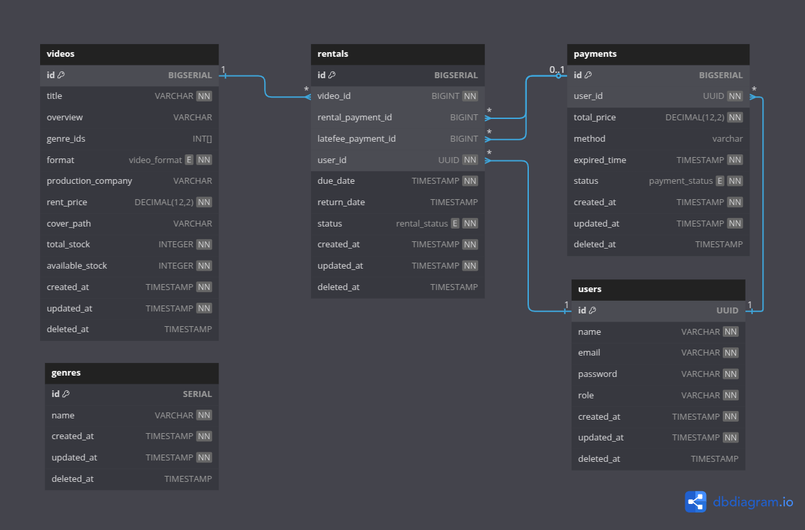

# Video Rental Shop (VRS) API

## App Requirements

1. Users can register to the application with a user role.
2. Users can log in to the application.
3. Admin accounts are pre-generated in the database.
4. Admins can log in to the application with an admin role.
5. Admins can add new video records in DVD, Blu-ray, and VHS formats with various prices.
6. Everyone can view a list of videos available for rent.
7. Everyone can search by title and filter the list of available videos.
8. Users can rent multiple video titles in one payment transaction.
9. Payment is only valid for 3 hours after being generated.
10. Users cannot rent more than 1 copy of the same video title and format, but can rent the same title in different formats.
11. Users can rent videos via the online application and collect the physical videos at the offline store later.
12. Users can return videos only at the offline store.
13. Users can return all rented videos at once or return only some videos and keep the rest for later return.
14. Every rental has a due date of 3 days starting from when the payment is success.
15. If videos are returned after the due date, users will be charged a late fee of $2 for each day beyond the due date, with a maximum cap of $30.
16. Only admins are allowed to record returned videos by inputting user data (user ID) and processing the videos returned by the user.

## Entity Relationship Diagram (ERD)

- Application Business ERD

  

  - `videos` - Stores information about available videos like title, description, stock, and genre
  - `users` - Contains user account details such as name, email, and contact information
  - `rentals` - Tracks video borrowing transactions with rental dates and status
  - `payments` - Records financial transactions related to video rentals
  - `genres` - Categorizes videos by different types/categories
    <br><br>

- Role-Based Access Control (RBAC) ERD

  

  - `roles` - Defines user roles such as admin or user
  - `permissions` - Specifies allowed actions like create, read, update, and delete
  - `resource` - Represents system resources that can be accessed (videos, users, rentals)
  - `rbac` - Junction table that connects roles with permissions for specific resources

> You can access the full diagram here: [video-rental-shop-dbdiagram.io](https://dbdiagram.io/d/video-rental-shop-erd-6836d3116980ade2ebd7538e)

## Architecture

This project uses clean architecture, a software design approach that emphasizes separation of concerns, component independence, and well-defined boundaries.


```bash
...
├── delivery               # Interface adapters layer - Handles delivery method for data access
│   └── rest
│       ├── middleware     # Contains request interceptors (auth, logging, etc.)
│       │   ├── ..._middleware.go
│       ├── ..._controller.go  # REST API handlers/controllers
│       ├── route
│       │   └── route.go   # API endpoint definitions and routing
├── dto                    # Data Transfer Objects - Defines request/response data structures
│   ├── ..._dto.go
├── entity                 # Enterprise business rules - Core domain models
│   ├── ..._entity.go
├── repository             # Data access layer - Implements data source interfaces
│   ├── postgresql         # Database implementation using PostgreSQL
│   │   ├── ..._repository.go
│   └── redis              # Cache implementation using Redis
│       ├── ..._cache_repository.go
├── usecase                # Application business rules - Contains business logic
│   ├── ..._usecase.go
└── util                   # Shared utilities and helper functions
```

## Built With


## API Documentation

You can access the API documentation here: https://documenter.getpostman.com/view/21669206/2sB2x3otYN

Alternatively, you can import the
[video-rental-shop-api.postman_collection.json](./video-rental-shop-api.postman_collection.json) into the Postman web interface or desktop application.

## Getting Started

### Run with Docker Compose

1. Make sure you have Docker and Docker Compose installed on your device. If not, follow the installation instructions here: https://docs.docker.com/compose/install/
2. Search for `!SETUP-COMPOSE` in all files (_ctr+shift+f in vs-code_) and adjust the values according to the instructions.
3. Run the following command to start the application:
   ```bash
   docker compose up
   ```
4. Test the API by accessing:
   ```
   http://localhost:8080/api/v1/welcome
   ```

### Run Locally

1. Ensure the following dependencies are installed:
   - Go version 1.24.0 or higher
   - PostgreSQL
   - Redis
2. Clone this repository:

   ```bash
   git clone https://github.com/snymnd/video-rental-shop-api.git
   ```

   Then change your working directory to the cloned repository folder.

3. Install the necessary dependencies:
   ```bash
   go mod tidy
   ```
4. Set up the environment by copying the `.env.example` file to a new `.env` file and configure the values as needed.
5. Create a database in your PostgreSQL instance with a name that matches the `DATABASE_NAME` value in your `.env` file.
6. Run database migrations and seeders:
   ```bash
   go run cmd/db/main.go
   ```
7. Start the application:
   ```bash
   go run cmd/web/main.go
   ```
8. Test the API by accessing:
   ```
   http://localhost:<port>/api/v1/welcome
   ```
   where `<port>` is the value defined in the `SERVER_ADDRESS` field in your `.env` file.
